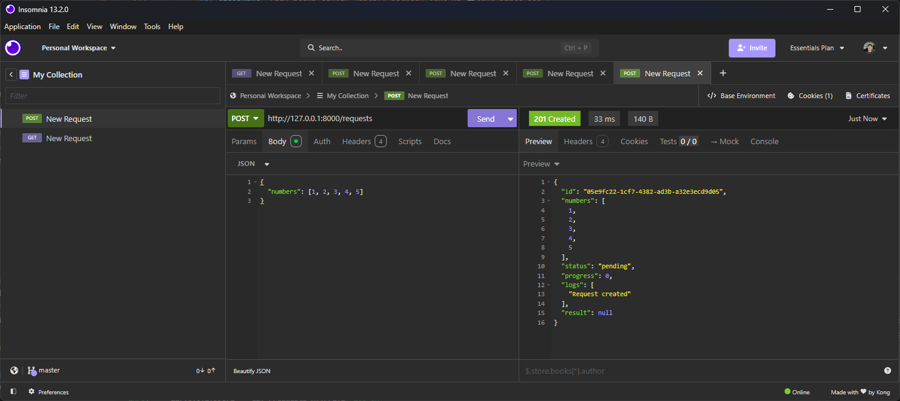
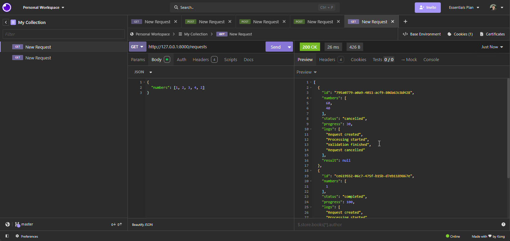

# NeoTracker | Process Tracker

[Ver a versão em inglês](README.md)

O NeoTracker é uma aplicação full-stack para enviar uma lista de números e acompanhar o processamento até o resultado final.

As requisições ficam armazenadas em memória. O processamento acontece em segundo plano, permitindo acompanhar o status, o progresso, os logs e o resultado.

## Funcionalidades

- Criar uma requisição com uma lista de números.
- Acompanhar o progresso em tempo real.
- Visualizar os logs e o resultado da soma.
- Cancelar uma requisição enquanto ela estiver pendente ou em processamento.
- Ver os três requests mais recentes na Home.
- Ver todos os requests na página de requests.

## Tecnologias

- Next.js com React, TypeScript e Tailwind CSS.
- Python com FastAPI
- Armazenamento em memória

## Estrutura do projeto

```text
frontend/
  src/app/
    components/
    requests/
    page.tsx
backend/
  main.py
PLANNING.md
README.md
```

## Como executar

### Backend

Na raiz do projeto:

```bash
cd backend
python -m venv venv
```

No Windows, ative o ambiente virtual:

```powershell
.\venv\Scripts\Activate.ps1
```

Instale as dependências e inicie a API:

```bash
pip install -r requirements.txt
uvicorn main:app --reload
```

A API ficará disponível em `http://localhost:8000`.

### Frontend

Em outro terminal:

```bash
cd frontend
npm install
npm run dev
```

O frontend ficará disponível em `http://localhost:3000`.

## Endpoints da API

| Método | Endpoint | Função |
| --- | --- | --- |
| `GET` | `/health` | Verifica se a API está disponível |
| `POST` | `/requests` | Cria uma nova requisição |
| `GET` | `/requests` | Lista todas as requisições |
| `GET` | `/requests/{id}` | Consulta o progresso e os detalhes |
| `POST` | `/requests/{id}/cancel` | Cancela uma requisição ativa |

Exemplo de criação:

```json
{
  "numbers": [10, 20, 30]
}
```

O processamento passa pelos status `pending` e `processing`, terminando em `completed`, `error` ou `cancelled`.

## Exemplos da API

### POST /requests

<p align="center">
  
</p>

### GET /requests

<p align="center">
  
</p>

## Fluxo do processamento

<p align="center">
  
</p>
